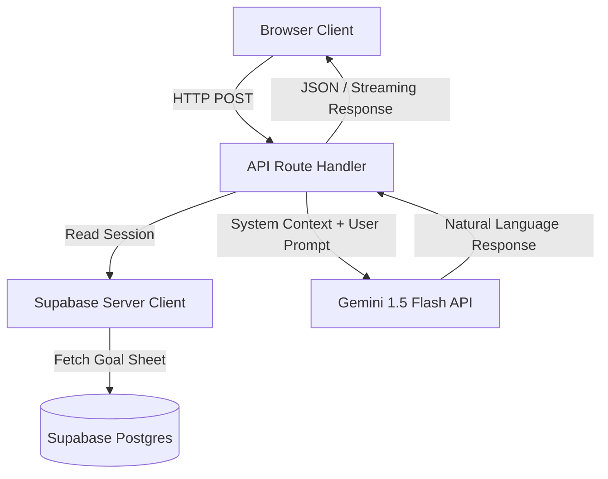

# AtomQuest AI Features Implementation Plan

This plan outlines the integration of small, high-impact AI features into the AtomQuest Goal Portal using the **free-tier Gemini API** (Gemini 2.5 Flash / Gemini 1.5 Flash). To keep the codebase lightweight and robust, all API interactions will be performed via vanilla `fetch` requests inside Next.js Route Handlers, requiring **zero extra npm dependencies**.

---

## User Review Required

> [!IMPORTANT]
> - **API Key Security**: The Gemini API Key will be loaded securely on the server via `process.env.GEMINI_API_KEY`. No client-side keys are used.
> - **Zero-Cost / Free Tier**: We will target the `gemini-1.5-flash` model, which offers a highly generous free tier (15 RPM, 1 million TPM, completely free).
> - **Performance**: Streaming responses will be used for the Chatbot to ensure a premium, lag-free user experience.

---

## Proposed AI Architecture



---

## Proposed AI Features

### 🌟 Feature 1: AI Progress Summaries

Provides instant, professional summaries of goal performance. It will be displayed at the top of the **My Goals** page (for employees) and the **Review Goals** modal (for managers).

#### Backend Route: `[NEW]` [route.ts](file:///home/atharva/Atomberg/atomquest/src/app/api/ai/summary/route.ts)
- **Security**: Verifies the logged-in user's session using Supabase SSR.
- **Data Gathering**: Fetches goals, UOMs, targets, weightages, and the latest check-in achievements for the specified employee.
- **Prompt Engineering**:
  ```typescript
  const prompt = `
    You are an elite corporate Performance Coach at Atomberg Technologies.
    Provide a professional, concise 2-sentence summary of the following employee's quarterly progress.
    Highlight the strongest goal, flag any goal at risk (low achievement or weightage imbalance), and offer one actionable next step.
    
    Employee: ${profile.first_name} ${profile.last_name}
    Role: ${profile.role}
    Active Cycle Goals:
    ${JSON.stringify(goalsData, null, 2)}
    
    Response guidelines:
    - Keep it strictly under 3 sentences.
    - Focus on data-driven observations.
    - Write in a highly constructive, encouraging, and corporate tone.
    - Speak directly to the employee ("You are on track...") if requested, or in third person for managers ("Angela is on track...").
  `;
  ```

#### Frontend Component: `[NEW]` [progress-summary.tsx](file:///home/atharva/Atomberg/atomquest/src/components/ai/progress-summary.tsx)
- Rendered as a beautiful premium glassmorphism alert card with a pulsing violet sparkle icon (`Sparkles`).
- Uses a loading skeleton state while fetching the summary.
- Displays an option to refresh/regenerate the summary.

---

### 💬 Feature 2: Interactive Goal Coach Chatbot

A floating chatbot in the bottom-right corner of the employee dashboard. It acts as an interactive coach, helping employees improve their goals, understand their scores, and bounce ideas.

#### Backend Route: `[NEW]` [route.ts](file:///home/atharva/Atomberg/atomquest/src/app/api/ai/chat/route.ts)
- **Context Injection**: Reads the logged-in user's goals and feeds them directly as `system_instruction` to Gemini.
- **System Instruction**:
  ```
  You are 'AtomQuest AI Coach', a warm, friendly, and expert performance advisor at Atomberg Technologies.
  The user you are chatting with is ${profile.first_name}. Here is their active goal sheet:
  ${JSON.stringify(goalsData)}
  
  Guidelines:
  - You have full context of their goals, targets, and progress. Use this to answer specific queries like "how is my score calculated?", "how can I improve my Conversion goal?", or "is my weightage balanced?".
  - Keep answers concise, actionable, and encouraging (max 3 sentences).
  - Do not invent goals or data not present in the goal sheet.
  - Always tie advice back to Atomberg's focus on engineering excellence and consumer-centric innovation.
  ```
- **Streaming Response**: Uses standard Server-Sent Events (SSE) or `ReadableStream` to stream the response character-by-character for that ultra-premium typing feel.

#### Frontend Component: `[NEW]` [goal-chatbot.tsx](file:///home/atharva/Atomberg/atomquest/src/components/ai/goal-chatbot.tsx)
- A gorgeous floating button (`Bot` or `MessageSquareCode`) at the bottom-right corner with a subtle hover zoom and ring animation.
- Clicking opens a premium Chat Panel with:
  - Header: "AtomQuest Coach" with a green active status dot.
  - Scrollable message area with beautiful message bubbles.
  - Suggestion chips to quick-start questions (e.g., *"How is my overall score calculated?"*, *"Which of my goals is at risk?"*, *"Give me tips for Cost Optimization"*).
  - Clean input field with a send icon.

---

## Verification Plan

### Automated Endpoint Checks
- Propose test scripts in `tests/ai-endpoints.spec.ts` using Playwright to verify that:
  - `POST /api/ai/summary` returns a valid, non-empty professional summary.
  - `POST /api/ai/chat` yields a valid stream / text response.
  - Unauthenticated requests are rejected with a 401 status.

### Manual Verification
- Deploy locally and interact with the coach chatbot in the dashboard.
- Verify responsiveness and micro-interactions across mobile and desktop.
